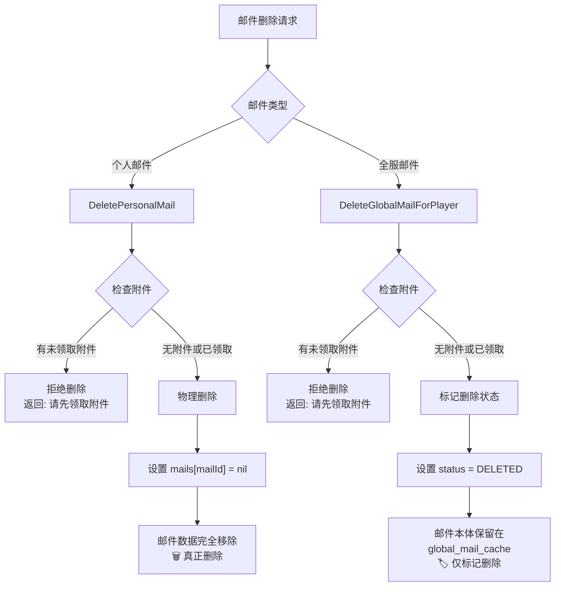

# 邮件删除逻辑分析报告

## 概述

本文档分析了邮件系统中个人邮件和全服邮件的删除逻辑，发现了两种不同的删除策略：**物理删除** vs **逻辑删除**。

## 分析结果

### 个人邮件删除逻辑 (`DeletePersonalMail`)

**✅ 确实会物理删除玩家的个人邮件数据**

#### 实现代码
```lua
function MailManager:DeletePersonalMail(uin, mailId)
    local player = gg.getPlayerByUin(uin)
    if not player or not player.mail then
        return false, "玩家不存在"
    end

    local mailData = player.mail.playerMail.mails[mailId]
    if not mailData then
        return true, "邮件已删除" -- 如果邮件已经不存在，也算删除成功
    end

    local mailObject = MailBase.New(mailData)

    -- 有未领取的附件时不能删除
    if mailObject:CanClaimAttachment() then
        return false, "请先领取附件"
    end

    -- 记录删除日志
    gg.log("--- 准备物理删除个人邮件 ---")
    gg.log("玩家UIN:", uin)
    gg.log("邮件ID:", mailId)
    gg.log("邮件标题:", mailData.title)

    -- 物理删除邮件
    player.mail.playerMail.mails[mailId] = nil
    player.mail.playerMail.last_update = os.time()

    return true, "邮件已删除"
end
```

#### 特点
- ✅ 邮件数据从 `player.mail.playerMail.mails` 中完全移除
- ✅ 数据无法恢复
- ✅ 真正的"删除"操作
- ✅ 释放存储空间

### 全服邮件删除逻辑 (`DeleteGlobalMailForPlayer`)

**❌ 不会删除邮件本体，只标记玩家状态**

#### 实现代码
```lua
function GlobalMailManager:DeleteGlobalMailForPlayer(uin, mailId, playerGlobalData)
    if not self.global_mail_cache or not self.global_mail_cache.mails[mailId] then
        return true, "删除成功" -- 全服邮件不存在，相当于对该玩家已经"删除"
    end

    local globalMailData = self.global_mail_cache.mails[mailId]
    local mailStatus = playerGlobalData.statuses[mailId]

    -- 如果邮件已经是删除状态，直接返回成功
    if mailStatus and mailStatus.status == MailEventConfig.STATUS.DELETED then
        return true, "邮件已删除"
    end

    local mailObject = MailBase.New(globalMailData)
    -- 检查是否有未领取的附件
    local hasUnclaimedAttachment = mailObject.has_attachment and (not mailStatus or not mailStatus.is_claimed)
    if hasUnclaimedAttachment then
        return false, "请先领取附件"
    end

    -- 更新或创建状态记录为已删除
    if not mailStatus then
        playerGlobalData.statuses[mailId] = {
            status = MailEventConfig.STATUS.DELETED,
            is_claimed = false -- 如果之前没有记录，那肯定没领取过
        }
    else
        mailStatus.status = MailEventConfig.STATUS.DELETED
    end
    playerGlobalData.last_update = os.time()

    return true, "删除成功"
end
```

#### 特点
- ⚠️ 邮件本体仍保留在 `global_mail_cache.mails` 中
- ⚠️ 只在玩家状态中标记为 `DELETED`
- ⚠️ 逻辑删除，数据可恢复
- ⚠️ 不释放存储空间

## 数据结构对比

### 个人邮件删除前后对比

**删除前：**
```lua
player.mail.playerMail.mails = {
    'mail_p_123': { title: '奖励', status: 1 },
    'mail_p_456': { title: '通知', status: 0 }
}
```

**删除后：**
```lua
player.mail.playerMail.mails = {
    'mail_p_456': { title: '通知', status: 0 }
}
-- ❌ mail_p_123 完全消失
```

### 全服邮件删除前后对比

**删除前：**
```lua
-- 邮件本体（全局共享）
global_mail_cache.mails = {
    'mail_g_789': { title: '系统邮件', content: '...', ... }
}

-- 玩家状态
player.mail.globalMailStatus.statuses = {
    'mail_g_789': { status: 1, is_claimed: true }
}
```

**删除后：**
```lua
-- 邮件本体（全局共享）- 未变化
global_mail_cache.mails = {
    'mail_g_789': { title: '系统邮件', content: '...', ... }
}

-- 玩家状态 - 仅状态改变
player.mail.globalMailStatus.statuses = {
    'mail_g_789': { status: 2, is_claimed: true }  // DELETED = 2
}
-- ✅ 邮件本体保留，仅状态变为DELETED
```

## 删除流程图



## 删除前提条件

### 共同条件

两种删除都有相同的前提条件：

```lua
-- 有未领取的附件时不能删除
if mailObject:CanClaimAttachment() then
    return false, "请先领取附件"
end
```

### CanClaimAttachment 判断逻辑

```lua
function _MailBase:CanClaimAttachment()
    return self.has_attachment and not self:IsClaimed() and self:IsValid()
end
```

**只有满足以下条件才允许删除：**
- 邮件没有附件，或
- 邮件有附件但已领取，或  
- 邮件已过期/无效

## 容错机制

`HandleDeleteMail` 函数包含容错机制：

```lua
-- 第一步：按照客户端指定的类型尝试删除
if isGlobal then
    success, message = GlobalMailManager:DeleteGlobalMailForPlayer(uin, mailId, player.mail.globalMailStatus)
else
    success, message = self:DeletePersonalMail(uin, mailId)
end

-- 第二步：如果第一次删除失败，尝试另一种类型（容错机制）
if not success then
    -- 尝试另一种邮件类型的删除
end
```

**容错策略：**
- 如果按指定类型删除失败，会尝试另一种类型
- 这意味着错误分类的邮件仍然可以被删除

## 潜在问题分析

### 1. 数据一致性问题

| 问题 | 个人邮件 | 全服邮件 |
|------|----------|----------|
| 删除策略 | 物理删除 | 逻辑删除 |
| 数据恢复 | ❌ 不可恢复 | ✅ 可恢复 |
| 存储占用 | ✅ 释放空间 | ❌ 持续占用 |
| 用户体验 | 删除即消失 | 删除后不显示 |

**影响：** 可能导致用户对不同类型邮件的删除行为产生困惑

### 2. 存储空间问题

**全服邮件的存储增长：**
- 全服邮件永远不会从 `global_mail_cache` 中真正删除
- 随着时间推移，存储空间会持续增长
- 需要考虑定期清理机制

### 3. 数据恢复不一致

**恢复能力差异：**
- 个人邮件：删除后无任何恢复可能
- 全服邮件：可通过修改玩家状态恢复显示

### 4. 性能影响

**查询性能：**
- `global_mail_cache` 会随时间无限增长
- 可能影响邮件查询和加载性能
- 需要考虑过期邮件的自动清理

## 建议优化方案

### 方案一：统一为逻辑删除

```lua
-- 修改个人邮件删除策略
function MailManager:DeletePersonalMail(uin, mailId)
    -- 不再物理删除，改为状态标记
    mailData.status = MailEventConfig.STATUS.DELETED
    -- 保留邮件数据，便于恢复和审计
end
```

**优势：**
- 数据可恢复
- 行为一致
- 便于审计

**劣势：**
- 存储空间增长
- 查询性能下降

### 方案二：统一为物理删除

```lua
-- 修改全服邮件删除策略
function GlobalMailManager:DeleteGlobalMailForPlayer(uin, mailId, playerGlobalData)
    -- 考虑引入引用计数机制
    -- 当所有玩家都删除后，才从 global_mail_cache 中移除
end
```

**优势：**
- 释放存储空间
- 查询性能好

**劣势：**
- 数据不可恢复
- 复杂度增加

### 方案三：混合策略（推荐）

```lua
-- 1. 保持现有逻辑删除
-- 2. 添加定期清理机制
function GlobalMailManager:CleanupExpiredMails()
    -- 清理过期且所有玩家都已删除的邮件
end

-- 3. 添加软删除恢复接口
function MailManager:RestoreDeletedMail(uin, mailId)
    -- 允许管理员恢复误删邮件
end
```

**优势：**
- 保持现有稳定性
- 解决存储增长问题
- 提供数据恢复能力

## 结论

1. **确认问题**：个人邮件删除确实会物理删除玩家的邮件数据
2. **策略差异**：个人邮件和全服邮件使用完全不同的删除策略
3. **建议**：考虑实施混合策略，在保持功能稳定的同时解决存储和性能问题

---

*生成时间：2024年*  
*分析版本：v1.0* 